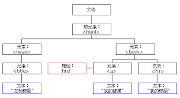

# JavaScript基础(八)

## 一、定时器

**单次定时器：** 间隔一段时间后异步（脱离程序主线程单独执行不会堵塞后面程序的执行）

启动单次定时器：setTimeout 

清除单次定时器：clearTimeout

**循环定时器：** 每一段时间，函数自动执行一次

启动循环定时器：setInterval

清除循环定时器：clearInterval

**setTimeout 与setInterval的参数：**

第一个参数：每一段时间要做的事情书写在函数内部。可以是匿名函数或者函数名。

第二个参数：函数间隔多少时间。单位是ms。不用书写单位。

从第二个参数开始，表示传递给第一个参数函数的数据。

定时器调用对象是window。但是一般不用书写window。表示加载之后立即调用定时器。

**clearTimeout与clearInterval的参数：**

定时器的名字

重新开启循环定时器时，一定要清除原有定时器，否则会造成定时器叠加。

## 二、DOM基础



我们前面学习的都是js语言的核心部分，也是ECMAScript。一般都是在控制台、输出语句里操作，JS还包括DOM和BOM。

DOM（Document Object Model， 文档对象模型）描绘了一个层次化的节点数，允许开发人员添加、移除和修改页面的某一部分。这使得JavaScript操作HTML，不是在操作字符串，而是在操作节点，极大地降低了编程难度。DOM对很多东西做了抽象，提供了丰富的api：取得元素、css样式、事件、运动、元素尺寸位置、节点操作等。

### 2.1.document对象

**document:** 表示文档（表示整个页面）对象。document对象具有页面几乎所有的方法或者属性。

读取：document.title页面的标题

赋值：使用=进行赋值

一般操作元素都是从获取元素开始的。

**获取元素的方法：**

**getElementById()方法：** 通过id属性获取元素对象

> 注意：
>
> 1.通过id属性得到的元素数据类型是对象
>
> 2.早期为元素添加id的时候，会在js中创建一个同名变量

**通过元素对象操作属性：**

读取：可以通过对象点方法得到属性名

设置：用=进行赋值

点语法只能读取或设置元素自带有的属性不能读取元素的自定义属性。

### 2.2.属性操作

**属性操作方法：**

**getAttubute()方法：** 可以读取元素自带属性或者自定义属性。

**setAttubute()方法：** 设置元素自带属性或者自定义属性。

**点语法和getAttubute(),setAttubute()方法区别：**

1.点语法只能获取或设置元素的自带属性，getAttubute(),setAttubute()方法可以读取元素自带属性或者自定义属性

2.点语法操作有些属性名需要改名字，getAttubute(),setAttubute()方法不用改名，是什么就书写什么。

class -->className、for-->htmlFor、rowspan-->rowSpan、colspan-->colSpan

3.style属性：通过点语法得到的是对象，而getAttubute()得到的是字符串。

4.点语法得到style对象可以继续打点。而getAttubute()得到的是字符串不能继续打点调用

> 总结：
>
> 除了自定义属性使用getAttubute(),其他所有情况都使用点语法

### 2.3.样式操作

css操作样式就是更改元素的样式。

1.通过点语法的style得到对象(包含css所有样式)。能过继续打点调用style属性。

> 注意:
>
>  属性名如果是单一属性需要改为驼峰命名法(删除横线，将横线后面的单词首字母大写)。
>
> 使用点语法设置css样式，是书写行内的样式。

**读取：** 通过点语法直接获取style对象中的css样式。

**设置：** 使用=进行设置，将新的属性值属性写在=右侧。必须用双引号包裹。

**属性值的写法：** 原来css属性值怎么写，js就怎么写

2.还可以通过setAttubute方法修改样式，会覆盖原有的行内样式，属性值是css字符串

### 2.4.DOM事件

事件监听：我们计算机在解析我们JS代码的时候，会去看某些元素身上是否添加了事件。并监听这些事件是否被触发，如果触发就立即执行相应的行为

| 事件名          | 解释   |
|--------------|------|
| onclick      | 单击   |
| ondblclick   | 双击   |
| onmouseenter | 鼠标进入 |
| onmouseleave | 鼠标离开 |
| onmousedown  | 鼠标按下 |
| onmouseup    | 鼠标弹起 |
| onfocus      | 获取焦点 |
| onblur       | 失去焦点 |
| onload       | 加载完成 |

元素绑定事件：

```js
元素.事件名=fn
```

可以绑定匿名函数或者函数（千万不要再函数名后面书写小括号）

> 注意：
>
> 1.我们在body中书写js时，需要将js书写在所有html元素之后。当html元素加载完毕后再执行js
>
> 2.如果js书写再head标签中，必须书写onload事件，window.onload表示当html元素加载完毕之后执行内部的语句。
>
> 3.不能多次绑定事件，会导致只允行第一个

### 2.5.getElementsByTagName

作用：通过元素的标签名得到元素，得到的时页面上所有同种标签组成的类数组对象。

> 注意：
>
> 1.类数组中保存的每一个数据都是元素对象。
>
> 2.得到的类数组对象具有length属性。表示保存同种标签的元素个数。
>
> 3.可以通过数据的索引值得到任何一个对象。
>
> 4.不管我们嵌入的多深getElementsByTagName()都可以找到。
>
> 5.类数组对象保存的顺序和标签之间的嵌套没有关系，和标签首次出现的顺序有关。

getElementById()和getElementsByTagName()都是兼容IE低版本。全线兼容。

getElementsByClassName()不兼容IE低版本。

### 2.6.连续打点调用

不但document可以打点调用getElementById()，或getElementsByTagName()，其他元素对象也可以打点调用该方法（getElementById只能被document调用元素无法调用）。还可以将多条语句连续书写。

通过getElementsByTagName()得到的一定是类数组对象，即使只有一个元素也是类数组对象。想得到该元素对象，仍然需要书写索引值。

批量操作事件：

通过getElementsByTagName()得到的是类数组对象，我们可以通过批量操作的方式给数组每一个元素添加相同事件。

>  事件回调函数中，存储索引值的两种方式:
>
> 1.利用IIFE和闭包实现对数据的存储
>
> 2.通过this访问元素自身存储的数据

### 2.7.对应与排它

我们一般习惯用一个元素去控制其它元素。根据它们之间的联系(索引值相同)进行书写。

排它：选中的元素改变，其它元素都是原状。

根据这一思想我们可以实现一些交互功能，如：选项卡的实现。

> 注意：
>
> 使用对应与排它思想的前提条件是：两个容器的元素个数要一致

### 2.8.计算样式

计算后的样式：指的是HTML元素在css各中选择器综合作用下，得到的最终样式。

高级浏览器的方法：window.getComputedStyle()，该方法接收一个要进行样式计算的元素，并返回一个可以进行属性查询的接口。返回接口提供一个名为getPropertyValue()的方法，用于检索特定样式属性的计算样式。getPropertyValue方法接收css属性名称，而不是驼峰式的名称。getPropertyValue()可以不写，直接用方括号来检索属性也可以。

getComputedStyle()方法：得到的样式是一个对象，包含了所有的这个元素的css样式。是window对象的方法。

> 注：
>
> 也可以直接使用[]继续得到具体的计算后的属性值。(中括号中可以使用驼峰也可以使用短横)

getPropertyValue()方法：得到的是具体的某一个属性的值。参数和css书写一样，不能使用驼峰。

IE6,7,8方法：低版本浏览器不认识getComputedStyle。IE低版本计算后的方法，currentStyle.(对象打点调用currentStyle，继续打点调用具体的某个计算后的样式属性)。currentStyle也可以直接使用[]得到计算后的样式属性。

>注意：
>
>不管是中括号还是点语法都只能用驼峰命名法

### 2.9.能力检测

不管式低版本还是还是高级浏览器都可以正常输出计算后的样式。需要进行能力检测(就是判断认不认识window.getComoutedStyle)

